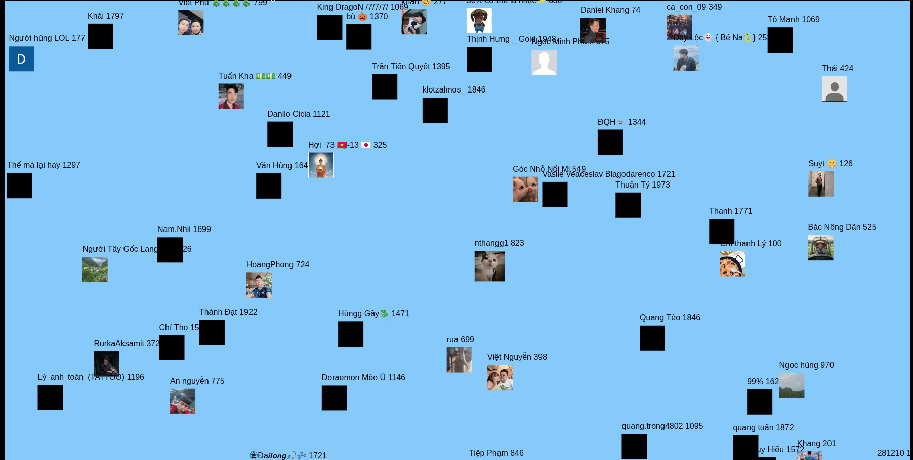
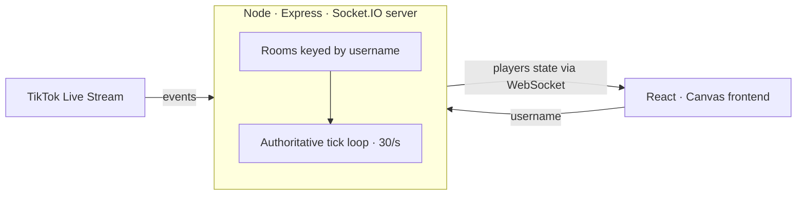

# mimmis

**Live TikTok viewers become wandering avatars in a real-time, multiplayer canvas world.**

**Live:** [mimmis.org](https://mimmis.org) · **Backend repo:** [mimmis-backend](https://github.com/hasperko/mimis-backend)



---

## What it is

Point mimmis at any live TikTok stream and every viewer walks into a shared canvas world as a **mimmi** — a little avatar wearing their profile picture. As people **chat, like, gift, follow, and share**, their mimmi **grows**. Go quiet and it **darkens** and eventually **despawns**. The whole world is streamed live to every browser watching, updating 30 times a second.

There's no database. Each stream is an **ephemeral world** that lives in memory and resets when the stream ends — the game *is* the live audience, nothing more.

## How it works



- The **backend** opens one live connection per stream via `tiktok-live-connector`, translates TikTok events into game actions, and runs a **server-authoritative game loop**: it owns all state, ticks 30×/second, and broadcasts the world to clients. Clients never simulate — they just draw what the server sends.
- The **frontend** is a React + TypeScript app rendering everything to a single `<canvas>`. It takes a TikTok username on a Welcome screen, opens a Socket.IO connection, and paints each frame from the latest server snapshot.
- It's **multi-tenant**: streams are isolated in Socket.IO *rooms* keyed by username, so many different streamers can run their own world at once, viewers of the same stream share a single TikTok connection, and a room tears itself down when its last viewer leaves.

## Tech stack

**Frontend** — React 19 · TypeScript · Vite · HTML Canvas · Socket.IO client
**Backend** — Node.js · Express · Socket.IO · [tiktok-live-connector](https://github.com/zerodytrash/TikTok-Live-Connector)
**Deploy** — Frontend on Vercel, backend on Render

## Engineering highlights

A few problems that made this more than a tutorial project:

- **19-digit TikTok IDs break JavaScript numbers.** TikTok user IDs exceed JS's safe integer range, so read as numbers they lose precision and identity checks silently fail. Every ID is kept as a **string** end-to-end so the same viewer maps to the same mimmi.
- **There is no "viewer left" event.** TikTok's live API never tells you when someone stops watching. The lifecycle is instead **activity-based**: every interaction resets an inactivity timer; the server darkens a mimmi past a threshold and despawns it once the timer runs out.
- **Multi-tenancy without a database.** A `Map` of rooms keyed by username gives each stream its own isolated world and a single shared upstream connection, with automatic teardown — the difference between "a demo I run once" and "a service other people can use."
- **Server-authoritative state.** All game logic lives on the server and streams out over WebSockets, so every viewer sees an identical, tamper-resistant world.

## Run it locally

**Frontend** (this repo):

```bash
npm install
npm run dev
```

By default the client connects to `http://localhost:3000`. To point it elsewhere, set `VITE_API_URL` to your backend's URL.

**Backend** ([mimmis-backend](https://github.com/hasperko/mimis-backend)):

```bash
npm install
npm start
```

Then open the frontend, enter a **currently-live** TikTok username, and watch the mimmis arrive.
